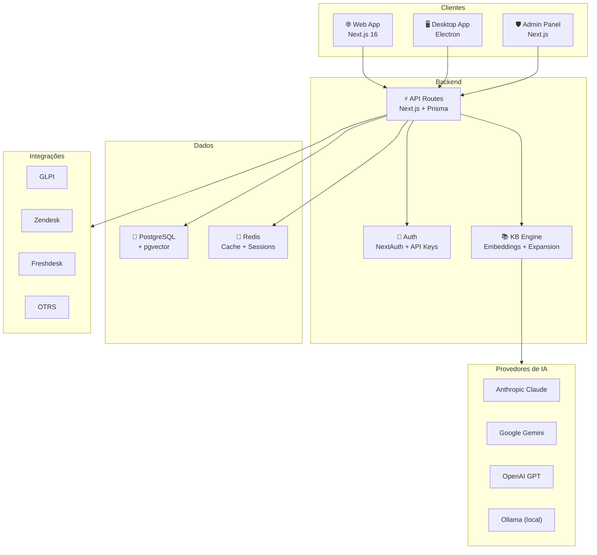

<div align="center">

# 🐱 Teki

**A camada de inteligência que faltava no seu suporte técnico.**

[](https://github.com/ScryLk/teki)
[](https://www.typescriptlang.org/)
[](https://nextjs.org/)
[](https://www.electronjs.org/)
[](LICENSE)
[](CONTRIBUTING.md)

> Teki conecta-se ao sistema de chamados que sua empresa já usa e potencializa seus técnicos com IA, detecção automática de erros e uma base de conhecimento que realmente funciona.

[Demo](https://teki.vercel.app) · [Documentação](docs/) · [Contribuir](CONTRIBUTING.md)

</div>

---

## ✨ O que é o Teki?

Imagine que toda vez que um técnico de suporte atende um chamado, ele tenha ao lado um assistente que já leu todos os manuais, lembra de todos os tickets resolvidos antes, e ainda detecta o erro na tela do cliente antes mesmo de alguém descrever o problema.

Esse é o Teki. Ele não substitui seu sistema de chamados — ele se conecta ao GLPI, Zendesk, Freshdesk ou OTRS que você já usa e adiciona uma camada de inteligência artificial que torna cada técnico mais rápido e preciso.

## 🎯 O Problema

**Técnicos gastam tempo reinventando a roda.** Aquele erro de NFe que um colega resolveu semana passada? Está perdido num ticket que ninguém vai encontrar. A solução do certificado digital expirado? Enterrada numa wiki desatualizada.

**Bases de conhecimento internas são cemitérios de PDFs.** Ninguém atualiza, ninguém encontra nada, e quando encontra está desatualizado. A busca é ruim, a organização é pior, e o técnico acaba ligando pro colega de novo.

**Sistemas de chamados não têm inteligência.** GLPI, Zendesk, Freshdesk — são ótimos para registrar e organizar tickets. Mas são apenas formulários. Não sugerem soluções, não detectam padrões, não aprendem com o histórico.

## 💡 A Solução

O Teki resolve cada um desses problemas com três diferenciais-chave:

### 1. Screen Inspection — Detecção antes da reação
O Teki monitora a tela do técnico e detecta erros automaticamente. Quando a rejeição 656 aparece no JPosto, o Teki já identificou o erro, encontrou 3 artigos relevantes e está sugerindo a solução — antes do técnico terminar de ler a mensagem.

### 2. Floating Assistant — Ajuda sem interrupção
Um assistente flutuante que aparece quando você precisa, sem atrapalhar o fluxo de trabalho. Ele analisa o contexto da tela e sugere soluções proativamente, como um colega experiente olhando por cima do ombro.

### 3. IA com Confiança Transparente
Cada resposta vem com um score de confiança (0-100%) e uma classificação clara: **[BASE LOCAL]** quando a resposta vem direto da sua base de conhecimento, **[INFERIDO]** quando a IA combina fontes parciais, ou **[GENÉRICO]** quando é conhecimento geral. Sem caixas pretas.

## 🚀 Funcionalidades

### Para Técnicos
- 🤖 **Chat com IA multi-provider** — Claude, Gemini, GPT, DeepSeek, Groq ou Ollama local
- 🔍 **Detecção automática de erros** — Screen Inspection identifica erros na tela em tempo real
- 💬 **Assistente flutuante** — Sugere soluções proativamente sem abrir o app
- 📚 **Base de conhecimento inteligente** — Busca semântica com embeddings + expansão progressiva
- 🎯 **Score de confiança transparente** — Saiba por que a IA tem X% de certeza
- 🔄 **Busca multilíngue** — Fallback automático em 7 idiomas quando a busca primária falha
- 🐱 **Gato mascote** — Animações que refletem o estado do sistema (porque suporte não precisa ser só trabalho)

### Para Gestores
- 📊 **Dashboard analítico** — Métricas de uso, eficiência da IA e custo por provider
- 👎 **Painel de feedback negativo** — Loop fechado: erro → feedback → correção → KB atualizada
- 🔌 **Integrações nativas** — GLPI, Zendesk, Freshdesk, OTRS com setup de 3 minutos
- 💳 **Gestão de planos** — Free, Starter, Pro e Enterprise com limites claros
- 🚩 **Feature flags** — Rollout gradual de funcionalidades por tenant

### Para Administradores da Plataforma
- 🖥️ **Super Admin Panel** — Visão cross-tenant com 12 páginas completas
- 🟢 **Monitoramento em tempo real** — SSE com alertas de latência e erro
- 📋 **Logs e requisições** — Busca completa com filtros por nível, tenant e período
- 📣 **Broadcast** — Notificações para todos os tenants
- 📜 **Auditoria** — Log de todas as ações administrativas

## 🏗️ Arquitetura



## 🛠️ Tech Stack

| Categoria | Tecnologia | Motivo |
|-----------|-----------|--------|
| Frontend | React + TypeScript + Tailwind CSS | Type-safe, ecossistema robusto, DX excelente |
| UI Components | shadcn/ui | Acessíveis, customizáveis, sem vendor lock-in |
| Web Framework | Next.js 16 (App Router) | SSR, API routes, performance |
| Desktop | Electron + electron-vite | Acesso nativo (tela, tray, OCR) |
| Banco de Dados | PostgreSQL 16 + pgvector | ACID, extensões vetoriais, JSON nativo |
| Cache | Redis 7 | Sessions, rate limiting, cache de buscas |
| ORM | Prisma | Type-safe queries, migrations automáticas |
| IA | Multi-provider (Claude, Gemini, GPT, Ollama) | Sem vendor lock-in, fallback automático |
| Busca Semântica | pgvector + Gemini Embeddings | Busca por similaridade vetorial |
| OCR | Tesseract.js | Reconhecimento de texto em screenshots, local |
| Criptografia | ECDH X25519 + AES-256-GCM | E2E para dados sensíveis |
| Auth | NextAuth + argon2id + TOTP | Multi-método com MFA |
| State | Zustand | Leve, sem boilerplate |
| Deploy | Vercel (web) + Electron builds | Zero-config para web, builds multiplataforma |

## 📦 Estrutura do Projeto

```
teki/
├── apps/
│   ├── web/            ← App web principal (Next.js 16)
│   ├── desktop/        ← App desktop com Screen Inspection (Electron)
│   └── admin/          ← Painel Super Admin (Next.js)
├── packages/
│   ├── shared/         ← Types, utils e permissões compartilhados
│   ├── database/       ← Schema Prisma e client do banco
│   └── ui/             ← Componentes UI compartilhados
├── docs/               ← Documentação do projeto
├── CONTRIBUTING.md     ← Guia de contribuição
└── CHANGELOG.md        ← Histórico de mudanças
```

## 🚀 Começando

### Pré-requisitos

- Node.js 20+
- pnpm 9+
- PostgreSQL 16+ com extensão pgvector
- Redis 7+

### Instalação

```bash
# Clone o repositório
git clone https://github.com/ScryLk/teki.git
cd teki

# Instale as dependências
pnpm install

# Configure as variáveis de ambiente
cp .env.example .env.local

# Rode as migrations do banco
pnpm db:migrate

# Gere o client Prisma
pnpm db:generate

# Inicie o desenvolvimento
pnpm dev
```

### Variáveis de Ambiente

| Variável | Descrição | Obrigatória |
|----------|-----------|:-----------:|
| `DATABASE_URL` | Connection string do PostgreSQL | ✅ |
| `REDIS_URL` | Connection string do Redis | ✅ |
| `NEXTAUTH_SECRET` | Secret para NextAuth (gerar com openssl) | ✅ |
| `NEXTAUTH_URL` | URL base da aplicação | ✅ |
| `GOOGLE_AI_KEY` | API key do Google AI (Gemini) | ⚡ |
| `OPENAI_API_KEY` | API key da OpenAI | ⚡ |
| `ANTHROPIC_API_KEY` | API key da Anthropic (Claude) | ⚡ |
| `OLLAMA_BASE_URL` | URL do servidor Ollama local | ⚡ |
| `ENCRYPTION_KEY` | Chave para criptografia de credenciais | ✅ |

⚡ = Pelo menos um provider de IA é necessário

### Comandos Úteis

```bash
pnpm dev              # Inicia web app em modo dev
pnpm dev:desktop      # Inicia app Electron em modo dev
pnpm dev:admin        # Inicia painel admin em modo dev
pnpm build            # Build de produção (todos os apps)
pnpm test             # Roda todos os testes
pnpm lint             # Lint em todos os workspaces
pnpm db:migrate       # Aplica migrations do Prisma
pnpm db:studio        # Abre Prisma Studio (visual DB)
```

## 📐 Planos

| | Free | Starter | Pro | Enterprise |
|---|:---:|:---:|:---:|:---:|
| **Preço** | R$ 0 | R$ 49,90/mês | R$ 149,90/mês | Sob consulta |
| Membros | 3 | 5 | 10 | Ilimitado |
| Conversas/mês | 50 | 200 | 500 | Ilimitado |
| Artigos KB | 20 | 100 | 200 | Ilimitado |
| Providers IA | 1 | 2 | Todos | Todos |
| Screen Inspection | — | — | ✅ | ✅ |
| Integrações | — | 1 | 3 | Ilimitado |
| Suporte | Comunidade | Email | Prioritário | Dedicado + SLA |

[Detalhes completos dos planos →](docs/PLANS.md)

## 🗺️ Roadmap

- [x] DevTools e Dev Mode
- [x] Schema de Usuários com LGPD
- [x] Base de Conhecimento + IA
- [x] Interface de Gestão da KB
- [x] Multi-Provider de IA com fallback
- [x] Logs e Auditoria
- [x] Rastreamento de Atividade
- [x] Formulário de Inserção KB
- [x] Floating Assistant
- [x] Segurança e Criptografia (ECDH + AES-256-GCM)
- [x] Interface de Autenticação
- [x] Schema de Conversas
- [x] Schemas Complementares
- [x] Integrações Externas (GLPI, Zendesk, Freshdesk, OTRS)
- [x] Interface de Configurações
- [x] Screen Inspection Engine
- [x] Painel Super Admin
- [x] Query Expansion Fallback (Busca Inteligente Progressiva)
- [x] Confidence Scoring + Settings UI
- [ ] App mobile (React Native)
- [ ] Transcrição de voz em chamadas
- [ ] Marketplace de templates KB
- [ ] API pública com SDK

## 🤝 Contribuindo

Contribuições são muito bem-vindas! Leia o [guia de contribuição](CONTRIBUTING.md) para começar.

```bash
# Fork, clone e crie uma branch
git checkout -b feature/minha-feature

# Desenvolva e teste
pnpm test

# Commit e PR
git commit -m "feat: minha nova feature"
git push origin feature/minha-feature
```

## 📄 Licença

Este projeto está licenciado sob a **MIT License** — veja o arquivo [LICENSE](LICENSE) para detalhes.

## 👤 Autor

**Lucas Silva** — Full Stack Developer

[](https://github.com/ScryLk)
[](https://linkedin.com/in/lucassilva)

---

<div align="center">

**Feito com ☕ e 🐱 no Brasil**

</div>
