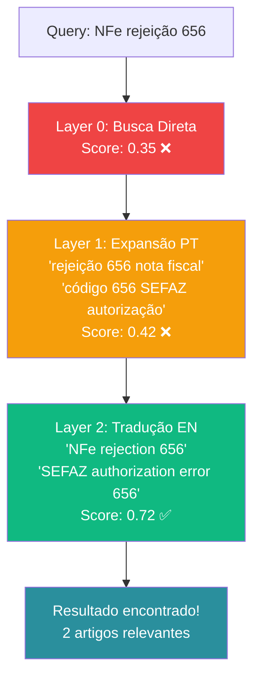
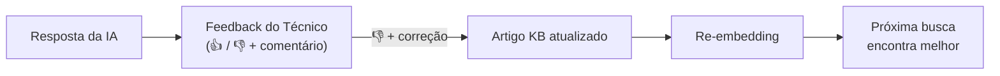

# 🤖 Sistema de IA do Teki

> Como o Teki usa inteligência artificial para transformar a busca em base de conhecimento e as respostas para técnicos de suporte.

## Visão Geral

O sistema de IA do Teki não é "um chatbot que usa GPT". É uma pipeline de 7 estágios que combina busca vetorial, expansão progressiva de queries, roteamento inteligente entre providers e scoring de confiança pós-resposta.

O resultado: cada resposta vem com um label transparente que diz ao técnico de onde veio a informação e quão confiável ela é.

## Multi-Provider — Sem Vendor Lock-in

O Teki suporta 6 providers de IA simultaneamente:

| Provider | Modelos | Melhor para |
|----------|---------|-------------|
| **Anthropic** | Claude Sonnet, Haiku | Raciocínio complexo, análise detalhada |
| **Google** | Gemini Pro, Flash | Velocidade, embeddings, custo |
| **OpenAI** | GPT-4o, GPT-4o-mini | Generalista, code generation |
| **DeepSeek** | DeepSeek Chat | Custo baixo, boa qualidade |
| **Groq** | LLaMA, Mixtral | Latência ultra-baixa |
| **Ollama** | Qualquer modelo local | Privacidade total, sem custo por token |

### Roteamento Inteligente

Cada tenant configura sua estratégia de roteamento:

- **Prioridade** — Define uma lista ordenada de providers. Usa o primeiro disponível.
- **Custo** — Seleciona o provider mais barato que atende os requisitos.
- **Latência** — Seleciona o provider com menor latência histórica.

### Fallback Automático

Se o provider primário falha (rate limit, timeout, erro 500), o router automaticamente tenta o próximo:

```
Tentativa 1: Claude Sonnet → 429 Rate Limit
Tentativa 2: Gemini Pro → ✅ Resposta em 1.2s
```

O técnico nem percebe. A resposta inclui o header `X-Teki-Model` para debug.

### BYOK — Bring Your Own Keys

Cada tenant pode usar suas próprias API keys. As chaves são criptografadas com AES-256-GCM antes de serem salvas no banco.

## Busca Progressiva — Query Expansion

Este é o diferencial técnico mais importante do Teki. A maioria das plataformas faz uma busca e, se não encontra, desiste. O Teki tenta até 4 camadas diferentes.

### O Problema

Técnico digita: "NFe rejeição 656"

A busca direta no banco retorna 0.35 de similaridade — abaixo do threshold. Em um sistema convencional, o técnico recebe "nenhum resultado encontrado".

### A Solução — 4 Layers



| Layer | Nome | O que faz | Quando ativa | Custo |
|-------|------|-----------|--------------|-------|
| **0** | Busca Primária | Busca vetorial direta em português | Sempre | Zero |
| **1** | Expansão Semântica | Gera 5 reformulações em PT via IA leve | Score L0 < 50% | ~100 tokens |
| **2** | Tradução Multilíngue | Traduz para idiomas configurados com term maps | Score L1 < 50% | ~150 tokens |
| **3** | Decomposição | Quebra em sub-problemas independentes | Score L2 < 50% | ~200 tokens |

### Term Maps — 7 Idiomas

O Layer 2 usa mapas de termos técnicos para tradução precisa. Não é tradução genérica — são termos de suporte técnico fiscal/ERP.

Idiomas suportados: Inglês, Espanhol, Alemão (com termos SAP), Francês, Japonês, Chinês, Coreano.

Exemplo de term map (PT → EN):
```
NFe → "electronic invoice", "e-invoice"
SEFAZ → "tax authority", "fiscal authority"
certificado digital → "digital certificate", "SSL certificate"
rejeição → "rejection", "error", "refused"
contingência → "contingency", "offline mode"
```

O filtro inteligente (`getRelevantTerms`) só inclui termos que aparecem na query, evitando poluir o prompt.

### Budget Control

O pipeline tem limite total de **800 tokens** e timeout de **5 segundos**. Se o budget acabar, retorna o melhor resultado disponível até o momento.

Na prática: 75% das buscas resolvem no Layer 0 (custo zero). Apenas 25% ativam layers adicionais.

## Confidence Score — 8 Sinais

Após cada resposta da IA, o Teki calcula um score de confiança de 0 a 100%. Não é um número arbitrário — são 8 sinais mensuráveis combinados com pesos configuráveis.

### Os 8 Sinais

| # | Sinal | Peso | O que mede | Como calcula |
|---|-------|------|-----------|--------------|
| 1 | **KB Relevance** | 25% | Qualidade da busca | Melhor score de similaridade vetorial |
| 2 | **Source Coverage** | 15% | Quantidade de fontes | 0 fontes=0, 1=40%, 2=70%, 3+=100% |
| 3 | **Historical Success** | 15% | Histórico do artigo | helpfulCount vs notHelpfulCount |
| 4 | **Specificity** | 12% | Qualidade da resposta | Heurística: code blocks, passos, termos técnicos |
| 5 | **Context Match** | 10% | Correspondência de contexto | Presença de KB + qualidade do match |
| 6 | **Solution Novelty** | 8% | Novidade da solução | Não repete tentativas anteriores |
| 7 | **Recency** | 8% | Atualidade dos artigos | Quão recente é o conteúdo usado |
| 8 | **Provider Reliability** | 7% | Confiabilidade do provider | Taxa de sucesso histórica do provider |

### Ajustes Pós-Cálculo

Além dos 8 sinais, 3 ajustes são aplicados:

- **Expansion Bonus** (+5%) — Se a expansão encontrou resultados melhores que a busca direta
- **Short Response Cap** (máx. 40%) — Respostas com menos de 50 caracteres são penalizadas
- **No KB Cap** (máx. 50%) — Sem resultados KB, a resposta nunca pode ser classificada como BASE LOCAL

### Classificação

| Score | Label | Significado |
|-------|-------|-------------|
| ≥ 80% | **[BASE LOCAL]** | Resposta fundamentada na base de conhecimento local |
| ≥ 50% | **[INFERIDO]** | Resposta com inferência parcial — IA combinando fontes |
| < 50% | **[GENÉRICO]** | Conhecimento geral da IA, sem base local |

### Presets de Peso

3 configurações pré-definidas para diferentes perfis de uso:

| Preset | KB Relevance | Specificity | Quando usar |
|--------|:-----------:|:-----------:|-------------|
| **Padrão** | 25% | 12% | Balanceado para maioria dos casos |
| **KB-Heavy** | 35% | 10% | Quando a base local é muito boa |
| **IA-Heavy** | 15% | 25% | Quando confia mais na qualidade da IA |

Admins podem criar presets customizados ajustando cada peso individualmente na página de Settings.

## Cenários Reais

### Cenário A — Resolução Direta (Layer 0)

> Técnico: "Como renovar certificado A1 no SEFAZ SP?"

1. Busca direta encontra artigo com 87% de similaridade
2. IA gera resposta com passos numerados, citando o artigo
3. Confidence: 89% — **[BASE LOCAL]**
4. Tempo: 1.1s | Tokens de expansão: 0

### Cenário B — Expansão Necessária (Layer 2)

> Técnico: "Erro 656 na transmissão da NFe"

1. Layer 0: score 0.35 (abaixo do threshold)
2. Layer 1 (PT): reformula para "rejeição 656 SEFAZ", score 0.42
3. Layer 2 (EN): traduz para "NFe rejection error 656 authorization", score 0.72 ✅
4. IA gera resposta combinando 2 artigos encontrados
5. Confidence: 68% — **[INFERIDO]** (+5% expansion bonus)
6. Tempo: 2.3s | Tokens de expansão: 247

### Cenário C — Sem Base Local (Layer 3 miss)

> Técnico: "Como configurar VPN split tunnel no FortiClient?"

1. Layers 0-3: nenhum resultado relevante na KB local
2. IA responde com conhecimento geral
3. Confidence: 38% — **[GENÉRICO]** (capped at 50% por No KB, mas specificity e context baixos)
4. Tempo: 3.1s | Tokens de expansão: 412
5. O técnico sabe que precisa verificar a resposta

## Feedback Loop

O sistema melhora ao longo do tempo:



1. Técnico dá feedback negativo com correção
2. Gestor revisa e atualiza o artigo KB
3. Artigo é re-processado (novo embedding)
4. Próxima busca similar encontra o artigo corrigido
5. Confidence score sobe naturalmente

O painel Admin mostra feedback negativo pendente para que gestores possam agir rapidamente.

## Configuração pelo Tenant

Admins configuram tudo em **Settings > IA & Modelos**:

**Busca Inteligente:**
- Habilitar/desabilitar expansão
- Profundidade (Rápida/Balanceada/Profunda)
- Idiomas de fallback (7 opções com flags)
- Modelo de expansão
- Budget de tokens

**Cálculo de Confiança:**
- Preset de pesos (Padrão/KB-Heavy/IA-Heavy/Custom)
- Ajuste individual dos 8 pesos
- Thresholds de classificação

---

📚 **Próximos:** [Arquitetura](ARCHITECTURE.md) · [Screen Inspection](SCREEN-INSPECTION.md) · [Features](FEATURES.md)
