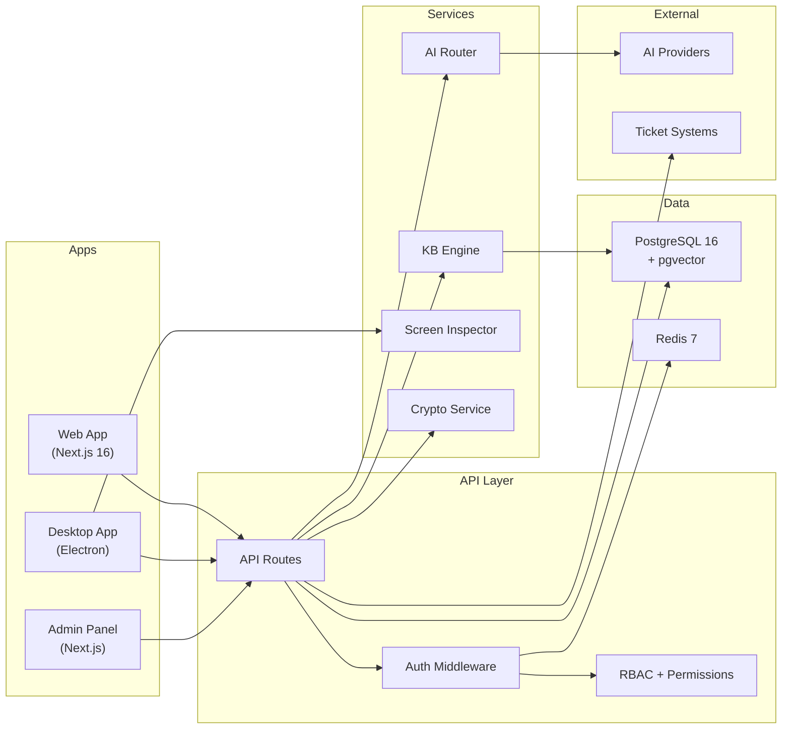
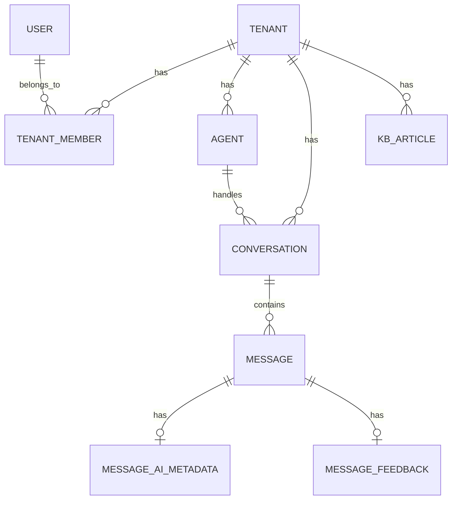
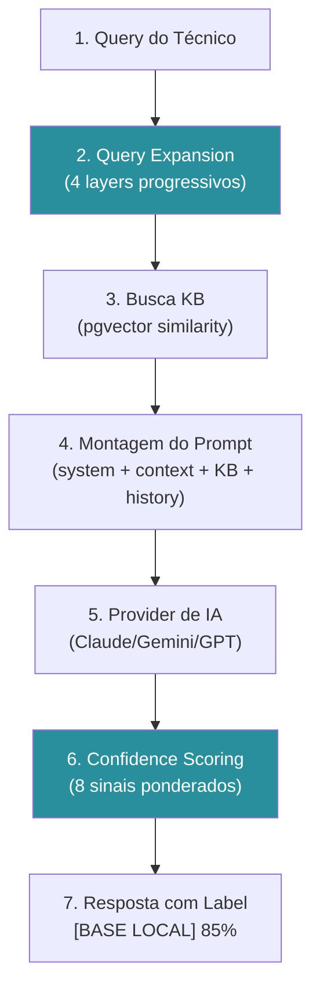
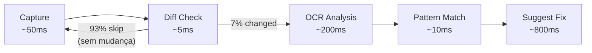

# 🏗️ Arquitetura do Teki

> Visão técnica da arquitetura do Teki. Para quem acabou de entrar no projeto e precisa entender como as peças se encaixam.

## Visão Geral

O Teki é um monorepo com 3 aplicações e 3 pacotes compartilhados. Todas as aplicações se comunicam via API Routes do Next.js, com PostgreSQL como banco principal e Redis para cache e sessions.



## Modelo Multi-Tenant

O Teki usa um modelo de **banco compartilhado com segregação por tenant_id**. Todos os tenants vivem no mesmo banco de dados PostgreSQL, mas cada registro pertence a um tenant específico.

### Por que banco compartilhado?

- **Simplicidade operacional** — Um banco para administrar, um backup, uma migration
- **Custo** — Não cria um banco por cliente
- **Escalabilidade suficiente** — PostgreSQL suporta milhões de registros por tabela com índices adequados

### Como a segregação funciona

1. Toda tabela de negócio tem uma coluna `tenant_id` (UUID)
2. O middleware de auth resolve o tenant do usuário autenticado
3. Todas as queries incluem `WHERE tenant_id = ?` automaticamente via Prisma
4. Índices compostos `(tenant_id, ...)` garantem performance



### Planos e Limites

Cada tenant tem um plano (`FREE`, `STARTER`, `PRO`, `ENTERPRISE`) que define limites de uso. Os limites são verificados em tempo real no middleware.

## Segurança — 3 Camadas

O Teki implementa criptografia em 3 níveis:

| Camada | Tecnologia | Protege |
|--------|-----------|---------|
| **Trânsito** | TLS 1.3 | Dados entre cliente e servidor |
| **End-to-End** | ECDH X25519 + AES-256-GCM | Mensagens sensíveis entre usuários |
| **Repouso** | AES-256-GCM | API keys, credenciais de integração no banco |

Em termos simples: ninguém lê os dados no caminho (TLS), ninguém lê no servidor (E2E), e ninguém lê no banco (at rest). Para detalhes completos, veja [SECURITY.md](SECURITY.md).

## Pipeline de IA

Quando um técnico envia uma pergunta, ela passa por 5 estágios:



### Estágio 2 — Query Expansion (o diferencial)

A maioria das buscas (75%) resolve no Layer 0 — busca direta sem custo extra. Quando a busca primária falha, layers adicionais são ativados progressivamente:

| Layer | Nome | O que faz | Custo |
|-------|------|-----------|-------|
| 0 | Busca Primária | Busca vetorial direta em PT | Zero |
| 1 | Expansão Semântica | Reformulações em português via IA | ~100 tokens |
| 2 | Tradução Multilíngue | Tradução para até 7 idiomas com term maps | ~150 tokens |
| 3 | Decomposição | Divide em sub-problemas independentes | ~200 tokens |

Budget total: máx. 800 tokens por pipeline, timeout de 5s.

### Estágio 6 — Confidence Scoring

Após a resposta, 8 sinais são calculados para gerar o score:

1. **KB Relevance** (25%) — Score de similaridade da busca
2. **Source Coverage** (15%) — Quantidade de fontes relevantes
3. **Specificity** (12%) — Análise heurística da resposta (code blocks, passos, etc.)
4. Mais 5 sinais (historical success, context match, novelty, recency, provider reliability)

Classificação: **BASE LOCAL** (≥80%), **INFERIDO** (≥50%), **GENÉRICO** (<50%).

Para detalhes completos do sistema de IA, veja [AI-SYSTEM.md](AI-SYSTEM.md).

## Pipeline de Screen Inspection

Exclusivo do app desktop. Captura a tela do técnico e detecta erros automaticamente.



Taxa de skip de 93% = eficiente, consome pouca CPU. Para detalhes completos, veja [SCREEN-INSPECTION.md](SCREEN-INSPECTION.md).

## Integrações — Connector Pattern

O Teki se conecta a sistemas de chamados existentes via um padrão de **connectors**:

```typescript
interface TicketConnector {
  testConnection(): Promise<boolean>;
  fetchTickets(since: Date): Promise<ExternalTicket[]>;
  fetchTicketById(id: string): Promise<ExternalTicket>;
  syncNotes(ticketId: string, notes: Note[]): Promise<void>;
}
```

Cada sistema (GLPI, Zendesk, Freshdesk, OTRS) implementa esse contrato. O tenant configura credenciais, mapeia campos, escolhe o modo de sync (read-only, bidirectional, write-back-notes) e pronto.

Para detalhes, veja [INTEGRATIONS.md](INTEGRATIONS.md).

## Decisões de Stack

| Decisão | Escolha | Alternativa | Motivo |
|---------|---------|-------------|--------|
| Banco | PostgreSQL | MongoDB | ACID, pgvector para embeddings, JSON nativo para dados flexíveis |
| Desktop | Electron | Tauri | Ecossistema maduro, Tesseract.js nativo, não precisa de Rust |
| State | Zustand | Redux | Menos boilerplate, API simples, middleware de persist |
| IA | Multi-provider | Só OpenAI | Sem vendor lock-in, fallback automático, custos otimizados |
| Busca | pgvector | Pinecone/Weaviate | Sem serviço extra, vive no mesmo banco, performance suficiente |
| Auth | NextAuth | Auth0 | Controle total, sem custo por MAU, customizável |
| Monorepo | pnpm workspaces | Turborepo/Nx | Simples, sem configuração extra, resolve para o tamanho do projeto |
| Criptografia | ECDH + AES-256-GCM | NaCl/libsodium | Padrão web, API nativa do Node.js crypto |

## Fluxo de Dados — Exemplo Real

O que acontece quando um técnico pergunta "NFe rejeição 656, o que fazer?":

1. **Web/Desktop** → POST `/api/v1/chat` com mensagem + conversationId
2. **Auth Middleware** → Valida sessão/API key, resolve tenant
3. **Chat Route** → Busca agent e histórico da conversa
4. **Query Expansion** → Layer 0 (busca direta) → score 0.35 (baixo)
5. **Layer 1** → Gera reformulações PT: "rejeição 656 NFe", "código 656 SEFAZ" → score 0.42
6. **Layer 2** → Traduz para EN: "NFe rejection 656", "SEFAZ error 656" → score 0.72 ✅
7. **Prompt Builder** → Monta system prompt + KB context + histórico
8. **AI Router** → Seleciona provider (Gemini Flash), envia request
9. **Confidence Scorer** → 8 sinais → 73% → [INFERIDO]
10. **Response** → Retorna texto + confidence + metadata
11. **Save** → Persiste mensagem + metadata no banco

Tempo total: ~1.5s (sendo 800ms a chamada de IA).

---

📚 **Próximos:** [Features](FEATURES.md) · [Sistema de IA](AI-SYSTEM.md) · [Segurança](SECURITY.md) · [API](API.md)
