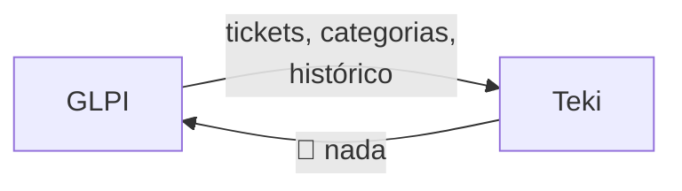
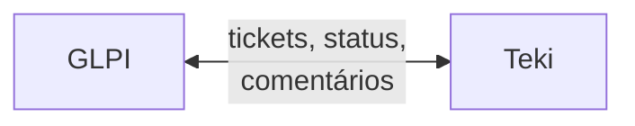
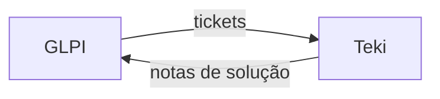

# 🔌 Integrações

> O Teki não substitui seu sistema de chamados. Ele se conecta ao que você já usa e adiciona inteligência.

## Filosofia

**"Não mude nada. Só conecte o Teki ao seu GLPI."**

Empresas já investiram tempo, dinheiro e treinamento nos seus sistemas de chamados. Migrar para outro sistema é caro, doloroso e arriscado. O Teki respeita isso.

Em vez de competir com GLPI, Zendesk ou Freshdesk, o Teki se conecta a eles como uma camada de inteligência adicional.

## Sistemas Suportados

| Sistema | Tipo | API | Status |
|---------|------|-----|--------|
| **GLPI** | Open-source IT Service Management | REST API v2 | 📋 Especificado |
| **Zendesk** | SaaS Customer Service | REST API v2 | 📋 Especificado |
| **Freshdesk** | SaaS Helpdesk | REST API v2 | 📋 Especificado |
| **OTRS** | Open-source Ticket System | REST/GenericInterface | 📋 Especificado |

## Como Conectar — 3 Passos

### Passo 1 — Credenciais

Informe a URL e as credenciais de API do seu sistema. O Teki suporta:

- **GLPI**: URL + App Token + User Token
- **Zendesk**: Subdomínio + Email + API Token
- **Freshdesk**: Domínio + API Key
- **OTRS**: URL + Username + Password (Basic Auth)

As credenciais são criptografadas com AES-256-GCM antes de serem salvas.

### Passo 2 — Teste de Conexão

O Teki testa a conexão automaticamente. Se algo der errado (URL incorreta, credencial inválida, firewall bloqueando), ele mostra exatamente qual o problema e como resolver.

### Passo 3 — Mapeamento

Configure como os dados fluem entre o Teki e o seu sistema:

**Field Mapping:** Mapeie campos do sistema externo para campos do Teki.
```
GLPI.titulo       → Teki.title
GLPI.conteudo     → Teki.description
GLPI.urgencia     → Teki.priority
GLPI.status       → Teki.status
```

**User Mapping:** Associe técnicos do sistema externo aos usuários Teki.
```
joao@empresa.com (GLPI) → joao@empresa.com (Teki)
```

## Modos de Sincronização

| Modo | Direção | O que faz | Quando usar |
|------|---------|-----------|-------------|
| **read_only** | Sistema → Teki | Importa tickets para contexto da IA | Quer usar a IA sem alterar o sistema |
| **bidirectional** | Sistema ↔ Teki | Sync completo em ambas direções | Quer gestão integrada |
| **write_back_notes** | Teki → Sistema | Escreve notas/soluções nos tickets | Quer documentar soluções da IA no ticket original |

### read_only (Recomendado para começar)

O modo mais seguro. O Teki importa tickets do sistema externo para dar contexto à IA, mas nunca modifica nada no sistema original.



### bidirectional

Sync completo. Tickets criados no Teki aparecem no GLPI e vice-versa. Mudanças de status são sincronizadas em ambas direções.



### write_back_notes

Meio-termo. O Teki lê do sistema e escreve apenas notas/comentários — geralmente as soluções sugeridas pela IA que o técnico aprovou.



## Sync Automático

Duas formas de manter os dados atualizados:

**Webhook (recomendado):** O sistema externo avisa o Teki quando algo muda. Latência: segundos.

**Polling:** O Teki verifica periodicamente se há novidades. Intervalo configurável (5min, 15min, 30min, 1h). Fallback quando webhooks não estão disponíveis.

## Connector Pattern

Para desenvolvedores que querem entender ou adicionar novos connectors:

Cada integração implementa o contrato `TicketConnector`:

```typescript
interface TicketConnector {
  // Testa se a conexão funciona
  testConnection(): Promise<boolean>;

  // Busca tickets desde uma data
  fetchTickets(since: Date): Promise<ExternalTicket[]>;

  // Busca um ticket específico
  fetchTicketById(id: string): Promise<ExternalTicket>;

  // Escreve notas/comentários num ticket
  syncNotes(ticketId: string, notes: Note[]): Promise<void>;
}
```

Para adicionar um novo sistema (ex: Jira, ServiceNow), basta implementar esse contrato.

## Limites por Plano

| Plano | Integrações | Modo |
|-------|:-----------:|------|
| Free | 0 | — |
| Starter | 1 | read_only |
| Pro | 3 | Todos os modos |
| Enterprise | Ilimitado | Todos + webhook + SLA de sync |

---

📚 **Próximos:** [Arquitetura](ARCHITECTURE.md) · [Segurança](SECURITY.md) · [Planos](PLANS.md)
