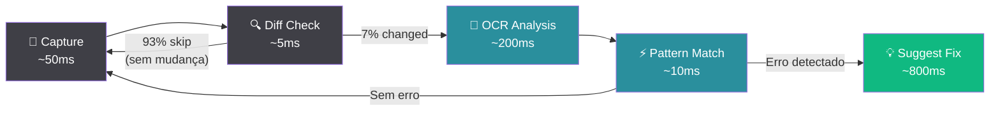

# 🖥️ Screen Inspection

> A funcionalidade mais diferenciada do Teki: detecção automática de erros na tela do técnico antes mesmo dele reagir.

## O que é

O Screen Inspection captura periodicamente a tela do técnico, analisa o conteúdo via OCR e detecta padrões de erro automaticamente. Quando identifica um problema, busca a solução na base de conhecimento e sugere ao técnico — tudo em menos de 3 segundos.

## Por que é revolucionário

Na maioria dos sistemas de suporte, o fluxo é:

1. Técnico vê o erro na tela
2. Copia a mensagem de erro
3. Cola no sistema de busca
4. Espera resultados
5. Lê os artigos
6. Volta pro sistema do cliente

Com o Screen Inspection:

1. Erro aparece na tela
2. Teki detecta automaticamente
3. Teki busca e sugere a solução

De 6 passos para 3. De 30 segundos para menos de 3.

## Cenário Real

> João é técnico de suporte na empresa XYZ. Ele está atendendo um chamado sobre emissão de NFe via JPosto.
>
> Enquanto navega pelo sistema do cliente, a tela mostra **"Rejeição 656 — Consumo Indevido"**.
>
> Em **2 segundos**, o Teki:
> - Detectou o texto "Rejeição 656" via OCR
> - Reconheceu o software JPosto
> - Buscou na KB e encontrou 2 artigos relevantes
> - Exibiu um tooltip: "Rejeição 656: Verificar se o CNPJ está habilitado para operações interestaduais no SEFAZ. [Ver artigo completo]"
>
> João nem precisou trocar de janela.

## Pipeline de 5 Estágios



### Estágio 1 — Capture (~50ms)

Captura um screenshot da tela ativa usando APIs nativas do Electron (`desktopCapturer`). A captura acontece em intervalos configuráveis (padrão: 3 segundos).

### Estágio 2 — Diff Check (~5ms)

Compara o screenshot atual com o anterior usando pixel hash. Se a tela não mudou significativamente, pula todos os outros estágios.

**Taxa de skip: 93%.** Isso significa que em 93% das capturas, o sistema gasta apenas 55ms (capture + diff). O OCR pesado só roda quando algo realmente mudou na tela.

### Estágio 3 — OCR Analysis (~200ms)

Quando o diff detecta mudança, o Tesseract.js extrai texto da imagem. O OCR roda **localmente** — nenhum dado de tela é enviado para servidores externos.

Otimizações:
- ROI (Region of Interest): foca nas áreas onde erros geralmente aparecem (centro, barras de status, diálogos)
- Cache de regiões: não re-processa áreas que não mudaram
- Resolução adaptativa: reduz resolução em máquinas mais lentas

### Estágio 4 — Pattern Match (~10ms)

O texto extraído é comparado contra uma biblioteca de 30+ patterns de erro:

```
Rejeição \d{3}          → Erro fiscal (NFe/NFCe)
cStat\s*[:=]\s*\d{3}    → Status SEFAZ
HTTP\s+[45]\d{2}        → Erro HTTP
SQLSTATE\[\w+\]         → Erro de banco
Error\s+\d{4,}          → Erro genérico com código
Timeout|Connection\s+refused  → Erro de rede
```

### Estágio 5 — Suggest Fix (~800ms)

Quando um pattern é detectado:
1. Identifica o software ativo (ver lista abaixo)
2. Busca na KB usando Query Expansion com o erro + software como contexto
3. Gera sugestão curta via IA (modelo leve/rápido)
4. Exibe como tooltip no Floating Assistant

## Softwares Detectados

O Teki reconhece 15+ softwares brasileiros de suporte técnico por assinatura visual:

| Software | Tipo | Detecção |
|----------|------|----------|
| JPosto | Fiscal / PDV | Logo + título da janela |
| SAT Fiscal | SAT/MFe | Título da janela |
| aCBrMonitor | NFe/NFCe | Ícone + título |
| Nota Certa | NFe | Título da janela |
| GLPI | Chamados | URL + layout |
| Zendesk | Chamados | URL + layout |
| pgAdmin | Banco | Título + ícone |
| Postman | API | Título + layout |
| FileZilla | FTP | Título + painel |
| PuTTY | SSH | Título + fundo preto |
| CMD/PowerShell | Terminal | Título + prompt |
| Visual Studio Code | IDE | Título + barra lateral |
| Excel | Planilha | Título + ribbon |
| SAP GUI | ERP | Barra de menu + tema |
| TOTVS Protheus | ERP | Título + smart client |

## Error Patterns Built-in

30+ patterns organizados por categoria:

**Fiscal:**
- Rejeição com código (001-999)
- Status SEFAZ (cStat)
- Erro de schema XML
- Certificado expirado/revogado
- Timeout de transmissão

**Rede:**
- Connection refused/timeout
- DNS resolution failed
- SSL/TLS handshake error
- Proxy authentication required

**Banco:**
- SQLSTATE errors
- Deadlock detected
- Connection pool exhausted
- Query timeout

**Sistema:**
- Access denied / Permission denied
- Disk full / Out of memory
- Service unavailable
- File not found

## Privacidade e LGPD

O Screen Inspection foi desenhado com privacidade como prioridade:

| Aspecto | Implementação |
|---------|--------------|
| **Consentimento** | Opt-in explícito. Desativado por padrão. |
| **Processamento** | 100% local (Tesseract.js no Electron) |
| **Armazenamento** | Screenshots nunca são salvos em disco |
| **Transmissão** | Nenhum dado de tela vai para nuvem |
| **Sensibilidade** | Áreas de senha são automaticamente mascaradas |
| **Controle** | Técnico pode pausar/desativar a qualquer momento |
| **Transparência** | Indicador visual mostra quando o inspection está ativo |

O técnico sempre sabe quando o Screen Inspection está rodando (ícone na barra de status) e pode desativar com um clique.

## Configuração

No app desktop, o técnico configura:

- **Intervalo de captura**: 1s, 3s, 5s, 10s (padrão: 3s)
- **Qualidade OCR**: Rápido, Balanceado, Preciso (padrão: Balanceado)
- **Regiões de foco**: Tela inteira ou áreas específicas
- **Softwares monitorados**: Lista whitelist de aplicações
- **Notificações**: Toast, tooltip, som (configurável)

---

📚 **Próximos:** [Sistema de IA](AI-SYSTEM.md) · [Arquitetura](ARCHITECTURE.md) · [Segurança](SECURITY.md)
