# 🎧 Voice Listening — "Teki escuta a chamada"

> O gatilho de áudio análogo ao Screen Inspection: o Teki escuta a chamada de
> suporte (a pessoa relatando o problema) e sugere soluções proativamente no
> assistente flutuante — apenas quando há sugestão útil e de alta confiança.

## Visão Geral

Mesma máquina de inferência do chat e do Screen Inspection (KB + router de IA
+ confidence score), novo gatilho: a voz do **relator** na chamada VoIP.

```mermaid
flowchart LR
    CAP["Canal B<br/>(loopback)"] --> VAD["VAD<br/>utterances"]
    VAD --> STT["STT híbrido<br/>local-first"]
    STT --> PRE["Pré-filtro<br/>(embedding barato)"]
    PRE --> WIN["Janela acumulada<br/>30–60s"]
    WIN --> KB["Retrieval KB<br/>(pgvector)"]
    KB --> AI["Síntese<br/>(AI router)"]
    AI --> GATE["Gate de confiança<br/>score + origem"]
    GATE --> DEDUP["Dedup +<br/>cooldown"]
    DEDUP --> CARD["Cartão no<br/>floating assistant"]
```



## Escopo do MVP

- **Somente VoIP** (Teams/Meet/Zoom). Telefone físico e presencial: fase 2.
- **Dois canais separados, sem diarização**: Canal A = microfone (técnico),
  Canal B = loopback do sistema (relator). O trigger lê **apenas o Canal B**.
- Captura via `electron-audio-loopback` com a versão do Electron **pinada**
  (regressões históricas de loopback) — ver `apps/desktop/docs/VOICE-CAPTURE.md`.

## STT híbrido (`apps/web/src/lib/stt`)

Espelha a arquitetura do router de IA:

| Provider | Origem | Quando |
|----------|--------|--------|
| `LocalWhisperProvider` (sidecar faster-whisper/whisper.cpp, `WHISPER_BASE_URL`) | `local` | **Sempre primeiro** |
| `CloudGroqSttProvider` (Groq Whisper, `GROQ_API_KEY`) | `cloud` | Só com `sttPolicy=HYBRID` **e** `cloudOptIn=true` do tenant |

Gatilhos de fallback (explícitos e auditados como `stt.fallback.cloud`):
estouro do orçamento de latência, sidecar indisponível, erro do sidecar.
Com `local_only` ou sem opt-in, **nunca** cai para cloud. A origem da
transcrição propaga até o cartão de sugestão.

**Custo**: o STT local tem custo zero por minuto; o cloud (Groq) cobra por
minuto de áudio — por isso é opt-in e último recurso.

## Trigger (`apps/web/src/lib/services/voice-trigger.service.ts`)

1. **Pré-filtro barato**: 1 embedding + busca pgvector direta
   (`prefilterMinSimilarity`, default 0.30). Corta a maioria dos utterances
   antes de gastar tokens com expansão/síntese.
2. **Janela acumulada**: buffer móvel de 45s (configurável) só do relator;
   o retrieval roda sobre a descrição acumulada.
3. **Retrieval + síntese**: `searchWithExpansion` (lib/kb) +
   `getProvider` (lib/ai) com modelo leve (`gemini-flash`).
4. **Gate de confiança** (reusa o sistema existente de 8 sinais):
   - `[BASE LOCAL]` com score ≥ **75%** (default) → push automático
   - `[INFERIDO]` → badge discreto "tenho uma ideia"
   - `[GENÉRICO]` → nunca dispara sozinho
5. **Dedup + cooldown**: hash sha256 + similaridade de embedding (0.85)
   contra sugestões já exibidas; cooldown de 90s por tópico após cada push.

Limiar, janela e cooldown são configuráveis por tenant
(`TenantVoiceConfig`) com defaults em `packages/shared/constants/voice.ts`.

## Planos

| | Free | Starter | Pro | Enterprise |
|---|:---:|:---:|:---:|:---:|
| Voice Listening | — | — | ✅ | ✅ |
| Cota de minutos/mês | — | — | 600 | Ilimitado |
| STT local | — | — | ✅ | ✅ (default) |
| Fallback cloud (opt-in) | — | — | ✅ | ✅ |

## LGPD

| Controle | Implementação |
|----------|--------------|
| Consentimento explícito | `UserConsent` com purpose `AUDIO_RECORDING`; modal antes da 1ª ativação |
| Transparência | Indicador persistente "Teki está ouvindo" + parar com 1 clique |
| Áudio bruto | **Nunca persistido** — processado em memória (desktop e servidor) e descartado |
| Transcrição | Persistida **apenas** sob opt-in do tenant (`persistTranscripts`), com `expiresAt` (retenção default 24h) |
| Auditoria | `AuditLog`: `voice.activated`, `voice.deactivated`, `voice.consent.*`, `stt.fallback.cloud`, `suggestion.surfaced` |
| Acesso a dados | `DataAccessLog` a cada retrieval que toca dados do tenant |

## Setup local (passo a passo)

1. **Banco**: aplique a migration aditiva (primeira migration tracked do
   projeto — veja `apps/web/prisma/migrations/README.md` para o baseline):

   ```bash
   pnpm db:migrate   # ou pnpm db:push no fluxo atual de dev
   ```

2. **STT local**: suba o sidecar Whisper (OpenAI-compatible, porta 9000):

   ```bash
   docker compose --profile voice up -d whisper
   ```

   Configure no `.env` do web: `WHISPER_BASE_URL=http://localhost:9000`.
   Modelos maiores (`Systran/faster-whisper-medium`) melhoram a precisão em
   PT-BR ao custo de latência/CPU. Sem GPU, prefira `small`.

3. **Fallback cloud (opcional)**: defina `GROQ_API_KEY` e ative
   `sttPolicy=HYBRID` + `cloudOptIn=true` no `TenantVoiceConfig` do tenant.
   Sem opt-in o fallback nunca acontece.

4. **Desktop**: `pnpm dev:pro` (a feature é bloqueada em Free/Starter) e, na
   primeira ativação pelo botão 🎧 do assistente flutuante, aceite o modal de
   consentimento. Valide também `pnpm dev:enterprise` (sem cota).

5. **Smoke test de captura** (por SO, obrigatório antes de bump do Electron):

   ```bash
   pnpm --filter @teki/desktop smoke:loopback
   ```

6. **Calibração do VAD**: se utterances estiverem sendo cortados cedo demais
   (ruído) ou não detectados (volume baixo), ajuste `energyThreshold` /
   `silenceHangoverMs` em
   `apps/desktop/src/renderer/floating/voice/utterance-segmenter.ts`.

## Endpoints

- `GET/POST /api/v1/voice/consent` — estado/registro do consentimento
- `POST /api/v1/voice/sessions` — inicia sessão (gates: plano, cota, consentimento, tenant)
- `DELETE /api/v1/voice/sessions/[id]` — encerra sessão
- `POST /api/v1/voice/sessions/[id]/utterances` — ingestão de utterance
  (áudio em memória → STT → trigger → sugestão ou null)

---

📚 **Próximos:** [Screen Inspection](SCREEN-INSPECTION.md) · [Sistema de IA](AI-SYSTEM.md) · [Segurança](SECURITY.md)
